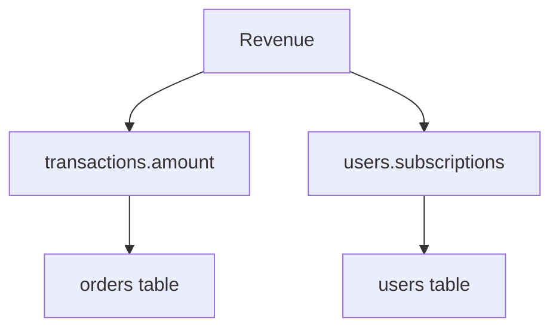

# Enhancement Rationale: Semantic Metrics Modeling Assistant

**Document Purpose:** Explain the strategic reasoning behind the proposed enhancements to transform this MCP agent from a prototype to a production-ready tool.

---

## Context: What We're Working With

The **Semantic Metrics Modeling Assistant** is an MCP (Model Context Protocol) agent that helps data teams define, validate, and manage metrics. Currently, it's a well-structured prototype with:

 **9 MCP tools** for metric operations  
 **Conversational interface** for metric definition  
 **Trust scoring system** for quality assessment  
 **dbt integration** for exporting metrics  
 **In-memory storage** (not persistent)  

---

## The Problem: Why Enhance?

### Current Limitations

1. **Data Loss** - All metrics disappear when the server restarts (in-memory only)
2. **No History** - Can't track who changed what or when
3. **Limited Integrations** - Only exports to dbt, not Looker/Tableau/other tools
4. **Untested** - No test suite means potential bugs and regression risks
5. **Poor Documentation** - Hard for new users to understand capabilities
6. **No Real Data** - Can't connect to actual metric definitions from dbt Cloud
7. **Simple Visualizations** - ASCII trees are basic, no modern diagram formats
8. **Manual Setup** - No easy installation or Claude Desktop integration guide

### Impact on Users

**Data Teams** face:
- Lost work if server crashes
- No audit trail for compliance
- Tool switching friction (can't export to their BI tools)
- Uncertainty about code quality
- Steep learning curve

**Result:** The tool remains a prototype instead of becoming a trusted production system.

---

## Enhancement Strategy

We're implementing **10 strategic improvements** in priority order to systematically address each limitation.

---

## Enhancement 1: SQLite Database Persistence

### What We're Adding
- Replace in-memory `METRICS_STORE` dict with SQLite database
- 4 tables: `metrics`, `metric_history`, `validation_tests`, `metric_usage`
- Automatic change tracking and audit logging
- Query capabilities (search, filter by owner/tag)

### Why This Matters

**Problem Solved:** Data loss on restart

**Business Value:**
- **Reliability** - Metrics persist across server restarts
- **Auditability** - Full history of who changed what and when (compliance requirement)
- **Scalability** - SQLite handles thousands of metrics efficiently
- **Queryability** - Can search and filter metrics programmatically

**Technical Rationale:**
- **SQLite chosen over**:
  - **PostgreSQL/MySQL**: Too heavy for single-server deployment, requires separate infrastructure
  - **JSON files**: No transaction support, no concurrent access safety, slow searches
  - **In-memory + pickle**: Data corruption risks, no query capabilities
- **SQLite benefits**:
  - Zero-configuration (no separate database server)
  - ACID transactions (data integrity)
  - Battle-tested (used by billions of devices)
  - Perfect for embedded use cases
  - Easy backup (single file)

**Real-World Scenario:**
A data team defines 50 metrics over weeks. Server crashes. Without persistence, they lose everything. With SQLite, they restart and all metrics are intact.

---

## Enhancement 2: Looker & Tableau Integrations

### What We're Adding
- `export_to_looker()` - Generate LookML syntax for Looker
- `export_to_tableau()` - Generate TDS files for Tableau
- Format converters for each platform's requirements

### Why This Matters

**Problem Solved:** Tool-switching friction

**Business Value:**
- **BI Tool Integration** - Metrics flow seamlessly into analysts' existing workflows
- **Single Source of Truth** - Same metric definition used everywhere
- **Reduced Errors** - No manual re-entry of metric logic across tools
- **Faster Adoption** - Teams don't abandon their current BI platform

**Technical Rationale:**
- **Looker LookML**: YAML-based, supports complex calculations, metric governance
- **Tableau TDS**: XML-based, includes metadata, connects to data sources
- Both are industry-standard BI tools used by Fortune 500 companies

**Real-World Scenario:**
Analytics team defines "Customer Lifetime Value" metric in the assistant. They click export, paste LookML into Looker, and the metric is instantly available in all dashboards. Previously, they'd manually recreate it in Looker (error-prone).

---

## Enhancement 3: Enhanced Trust Scoring Algorithm

### What We're Adding
- Weighted scoring factors (not all factors equal)
- Historical trust score tracking (trend over time)
- Time-decay function (older metrics without updates decrease in trust)
- Trust score visualization (sparklines showing trend)

### Why This Matters

**Problem Solved:** Oversimplified quality assessment

**Business Value:**
- **Risk Management** - Identify metrics that need attention
- **Prioritization** - Focus on low-trust metrics first
- **Quality Trends** - See if metric health improving or degrading
- **Stakeholder Confidence** - Quantifiable quality metrics for leadership

**Technical Rationale:**

**Current Algorithm Issues:**
```
freshness (20) + tests (25) + usage (20) + docs (20) + ownership (15) = 100
```
- All factors weighted equally (doesn't reflect real importance)
- No time dimension (can't see trends)
- Static thresholds (not adaptive to team norms)

**Improved Algorithm:**
```
Base Score: freshness (15%) + tests (35%) + usage (20%) + docs (15%) + ownership (15%)
Multipliers: 
  - Recent activity boost (+10%)
  - Consistency bonus (+5%)
Time Decay: Score -= (days_stale / 30) * 5%
```

**Why These Weights:**
- **Tests (35%)** - Most important: proves accuracy
- **Usage (20%)** - High usage = battle-tested
- **Freshness (15%)** - Recent updates show maintenance
- **Docs (15%)** - Important but not critical
- **Ownership (15%)** - Accountability matters

**Real-World Scenario:**
A metric had 80% trust score 3 months ago. No one updated it. Algorithm now shows 60% with downward trend arrow. Team sees it's degrading and investigates.

---

## Enhancement 4: Mermaid Diagram Visualizations

### What We're Adding
- Convert dependency trees to Mermaid diagram syntax
- Show metric lineage as flowcharts
- Render in markdown/documentation tools
- Interactive exploration of relationships

### Why This Matters

**Problem Solved:** Poor visualization of complex relationships

**Business Value:**
- **Clarity** - See how metrics relate at a glance
- **Impact Analysis** - Understand downstream effects of changes
- **Communication** - Share diagrams with stakeholders
- **Onboarding** - New team members understand metric ecosystem faster

**Technical Rationale:**

**Current ASCII Trees:**
```
 revenue
     transactions.amount
     users.subscriptions
```
Pros: Works in terminal  
Cons: Hard to read, no colors, not shareable, breaks with complex graphs

**Mermaid Diagrams:**

Pros: Beautiful, interactive, renders in GitHub/Notion/Confluence, supports colors/shapes  
Cons: Requires rendering engine (but GitHub/many tools support natively)

**Real-World Scenario:**
Data lead presents to executives. Shows Mermaid diagram of how "Annual Recurring Revenue" depends on 5 upstream metrics. Executives immediately understand the data lineage. Previously, they'd need to imagine from text descriptions.

---

## Enhancement 5: Comprehensive Test Suite

### What We're Adding
- pytest framework with 50+ tests
- Unit tests for each tool
- Integration tests for database operations
- Fixtures for sample data
- CI/CD ready

### Why This Matters

**Problem Solved:** No confidence in code quality

**Business Value:**
- **Reliability** - Catch bugs before production
- **Regression Prevention** - Changes don't break existing features
- **Documentation** - Tests show how code should work
- **Faster Development** - Refactor with confidence
- **Professional Quality** - Enterprise teams require tests

**Technical Rationale:**

**Why pytest:**
- Industry standard for Python testing
- Rich plugin ecosystem
- Clear assertion syntax
- Excellent fixture system
- Async support (important for MCP)

**Test Coverage Strategy:**
```
Unit Tests (70%): Individual functions work correctly
Integration Tests (20%): Components work together
End-to-End Tests (10%): Full workflows work
```

**Real-World Scenario:**
Developer adds new feature. Runs `pytest`. Tests fail because change broke metric search. Bug caught before deployment. Without tests, bug ships to production, users lose work.

---

## Enhancement 6: Comprehensive Documentation

### What We're Adding
- **API.md** - Complete function reference with examples
- **ARCHITECTURE.md** - System design, data flow, extension points
- **USAGE.md** - Step-by-step guides, workflows, best practices

### Why This Matters

**Problem Solved:** Steep learning curve

**Business Value:**
- **Faster Onboarding** - New users productive in hours not days
- **Self-Service** - Reduce support questions
- **Adoption** - Clear docs = more users
- **Maintenance** - Future developers understand design decisions

**Technical Rationale:**

**Documentation Hierarchy:**
1. **README** - Quick start (5 min)
2. **USAGE** - Common workflows (30 min)
3. **API** - Complete reference (search when needed)
4. **ARCHITECTURE** - Deep dive (1-2 hours)

**Why This Structure:**
- Matches user journey (quick start  learn features  master tool  extend)
- Searchable (each doc has clear scope)
- Examples-driven (every function has code sample)

**Real-World Scenario:**
New analyst joins team. Reads README, runs example. Works! Reads USAGE to learn workflows. After 1 hour, creating custom metrics. Previously, would need 1:1 training from teammate (expensive).

---

## Enhancement 7: dbt Cloud API Integration

### What We're Adding
- Connect to dbt Cloud REST API
- Fetch existing metric definitions
- Sync bidirectionally (import from dbt, export back)
- Detect conflicts and offer merge strategies

### Why This Matters

**Problem Solved:** Metrics exist in dbt but can't leverage them

**Business Value:**
- **Don't Rebuild** - Import existing metrics instead of redefining
- **Single Source of Truth** - dbt remains authoritative
- **Continuous Sync** - Changes in dbt flow to assistant automatically
- **ROI** - Leverage existing investments in dbt

**Technical Rationale:**

**Why dbt Cloud API:**
- Standard REST API (well-documented)
- Authentication via API tokens
- Provides full metric metadata
- Supports webhooks for real-time sync

**Integration Pattern:**
```
dbt Cloud (source of truth)
     API fetch
Assistant (adds trust scoring + governance)
     Enhanced metadata
Back to dbt Cloud (optional)
```

**Real-World Scenario:**
Team has 200 metrics defined in dbt over 2 years. Instead of manually importing, run `sync_from_dbt_cloud()`. All 200 metrics appear in assistant with trust scores computed. Now can add governance layer on top of existing definitions.

---

## Enhancement 8: Git Integration for Version Control

### What We're Adding
- Store metrics as YAML files in Git repo
- Automatic commits on metric changes
- View history via git log
- Rollback capability
- Branch/PR workflow support

### Why This Matters

**Problem Solved:** No version control for metric definitions

**Business Value:**
- **Auditability** - Full history with git blame
- **Collaboration** - Use Git workflows teams already know
- **Rollback** - Undo mistakes easily
- **Code Review** - Metric changes go through PR process
- **Compliance** - Meets regulatory requirements for audit trails

**Technical Rationale:**

**Why Git over Database History:**

| Feature | Git | Database History |
|---------|-----|------------------|
| Diff Visualization |  Rich |  Text only |
| Branching |  Full support |  No concept |
| Collaboration |  PR workflows |  Manual |
| External Tools |  GitLens, etc. |  Custom UI needed |
| Industry Standard |  Yes |  Proprietary |

**Storage Format:**
```yaml
# metrics/revenue.yaml
name: Total Revenue
description: Sum of all completed transactions
calculation: SUM(amount) FROM transactions WHERE status='completed'
owner: "@revenue-team"
tags: [revenue, financial, key-metric]
```

**Real-World Scenario:**
Analyst changes "Churn Rate" definition. Git commit created. Reviewer sees diff in PR, asks clarifying question. Metric isn't merged until approved. Later, need to see why definition changed in March 2025. `git blame metrics/churn_rate.yaml` shows exact commit and author.

---

## Enhancement 9: Easy Installation & Packaging

### What We're Adding
- Fix pyproject.toml for proper packaging
- Create installation guide
- Add CLI entry point: `semantic-metrics serve`
- Publish to PyPI (optional)
- Pre-configured examples

### Why This Matters

**Problem Solved:** Hard to install and get started

**Business Value:**
- **Lower Barrier** - Anyone can install with `pip install semantic-metrics`
- **Faster Trials** - Evaluate tool in 5 minutes
- **Professional Image** - Polished installation = trust
- **Distribution** - Share within organization easily

**Technical Rationale:**

**Current Process:**
```bash
git clone repo
cd repo
pip install -e .  # Might fail
figure out how to run server
```
Problems: Requires Git knowledge, editable install confusing, unclear how to start

**Improved Process:**
```bash
pip install semantic-metrics
semantic-metrics init  # Creates config
semantic-metrics serve  # Starts server
```
Done in 30 seconds!

**Why PyPI:**
- Standard Python package distribution
- Version management
- Dependency resolution
- Trusted by enterprises
- Simple: `pip install`

**Real-World Scenario:**
Executive wants to try tool. Currently: needs developer to set up (1 hour). Improved: executive runs 3 commands (2 minutes). More likely to adopt.

---

## Enhancement 10: Claude Desktop Integration Guide

### What We're Adding
- Step-by-step setup instructions
- Configuration file examples (Windows/Mac/Linux)
- Troubleshooting section
- Screenshots/video walkthrough
- Test scenarios

### Why This Matters

**Problem Solved:** Users don't know how to connect to Claude Desktop

**Business Value:**
- **Unlock Full Potential** - MCP + Claude = powerful combination
- **User Delight** - Conversational interface is the main UX
- **Competitive Advantage** - Most tools don't have AI chat interface
- **Future-Proof** - MCP is emerging standard

**Technical Rationale:**

**Why Claude Desktop:**
- Native MCP support
- Large context window (handles complex metric discussions)
- Code understanding (can help write calculations)
- Iterative refinement (natural metric definition process)

**Setup Complexity:**
- Edit JSON config file (error-prone)
- Platform-specific paths (Windows vs Mac)
- Python environment issues
- Server startup troubleshooting

**Solution: Comprehensive Guide:**
- Platform-specific instructions
- Copy-paste configs
- Common errors + solutions
- Visual confirmation steps

**Real-World Scenario:**
Data analyst wants conversational interface. Follows guide, connects to Claude Desktop. Now asks: "Define monthly active users as count of distinct user_ids who logged in within last 30 days." Claude uses MCP tools to create metric with proper structure. Analyst thrilled by ease.

---

## Implementation Priority Rationale

### Why This Order?

**Tier 1 (Foundation): Tasks 1, 5, 6**
- Database persistence = data safety (blocking issue)
- Tests = development confidence
- Documentation = adoption enabler

Must have these before promoting to production.

**Tier 2 (Integration): Tasks 2, 7, 10**
- BI tool exports = integrate with existing workflows
- dbt Cloud sync = leverage existing assets
- Claude Desktop = unlock conversational UX

These make the tool useful in real workflows.

**Tier 3 (Polish): Tasks 3, 4, 8, 9**
- Enhanced trust scoring = better insights
- Visualizations = better UX
- Git integration = better collaboration
- Packaging = easier distribution

These elevate from "useful" to "delightful."

---

## Success Metrics

How we'll know enhancements worked:

1. **Database Persistence**: Zero data loss incidents post-deployment
2. **Integrations**: Users export to >=2 different BI tools
3. **Trust Scoring**: Users act on trust score recommendations (update low-trust metrics)
4. **Tests**: 80%+ code coverage, CI/CD passes consistently
5. **Documentation**: Support questions decrease 50%
6. **dbt Integration**: Teams sync 100+ metrics from existing dbt projects
7. **Visualizations**: Users share Mermaid diagrams in presentations
8. **Git Integration**: Metrics stored in Git repos, PR workflows used
9. **Installation**: New users productive within 15 minutes
10. **Claude Desktop**: 80%+ of users prefer conversational interface

---

## Risks & Mitigations

### Risk 1: Database Migration Complexity
**Impact:** Existing users lose data  
**Mitigation:** Create migration script, test thoroughly, provide rollback plan

### Risk 2: dbt API Changes
**Impact:** Integration breaks  
**Mitigation:** Version detection, graceful degradation, regular API monitoring

### Risk 3: Over-Engineering
**Impact:** Complexity overwhelms users  
**Mitigation:** Keep defaults simple, advanced features opt-in, progressive disclosure

### Risk 4: Performance Degradation
**Impact:** Slow queries on large metric sets  
**Mitigation:** Database indexes, query optimization, caching layer

### Risk 5: Maintenance Burden
**Impact:** Can't keep integrations updated  
**Mitigation:** Automated tests, CI/CD, community contributions

---

## Timeline Estimate

**Conservative (One Developer):**
- Tier 1 (Foundation): 2-3 weeks
- Tier 2 (Integration): 2-3 weeks  
- Tier 3 (Polish): 1-2 weeks
- **Total: 5-8 weeks**

**With Team (3 Developers):**
- **Total: 2-3 weeks** (parallel work)

---

## Conclusion

These enhancements transform the Semantic Metrics Modeling Assistant from a **proof of concept** into a **production-grade system** that:

 Doesn't lose data (persistence)  
 Works with real ecosystems (integrations)  
 Can be trusted (tests, scoring, docs)  
 Fits into workflows (Claude, Git, BI tools)  
 Is easy to adopt (packaging, guides)  

The result: A tool that data teams actually use daily, not just try once and abandon.

---

*Last updated: January 3, 2026*
