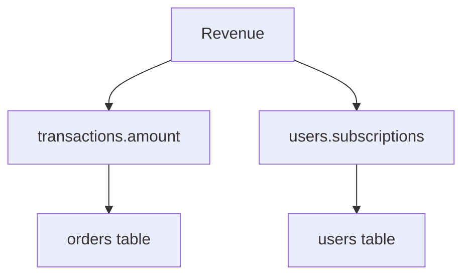
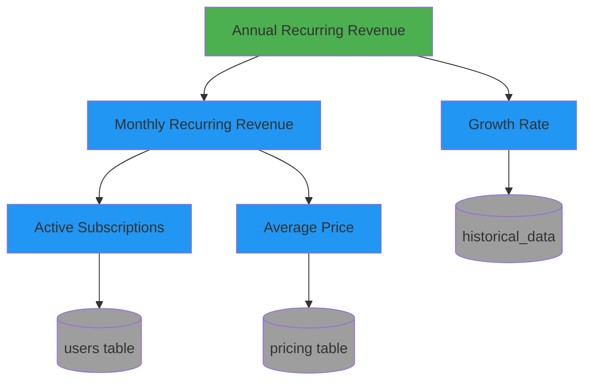

# Enhancement 04: Mermaid Diagram Visualizations

**Status:** ✅ Complete  
**Priority:** Medium (Tier 3 - Polish)  
**Implemented:** January 3, 2026

---

## Overview

Add Mermaid diagram generation for visualizing metric dependencies and lineage as modern flowcharts that render beautifully in GitHub, Notion, Confluence, and other markdown tools.

## Problem Solved

**Before:** ASCII tree diagrams that are hard to read and don't scale:
```
├── revenue
    ├── transactions.amount
    └── users.subscriptions
```

**After:** Interactive Mermaid flowcharts:


## Implementation

### New MCP Tool: `generate_mermaid_diagram`

```python
@mcp.tool()
def generate_mermaid_diagram(metric_name: str, depth: int = 3) -> str:
    """
    Generate Mermaid flowchart diagram showing metric dependencies.
    
    Args:
        metric_name: Name of the metric to visualize
        depth: How many levels deep to traverse (default: 3)
        
    Returns:
        Mermaid diagram syntax ready to render
    """
```

### Features

- **Automatic Layout** - Mermaid handles positioning
- **Interactive** - Click nodes in rendered view
- **Color Coding** - Metrics vs tables vs external sources
- **Bidirectional** - Show both upstream and downstream dependencies
- **Shareable** - Works in GitHub, Confluence, Notion, VS Code

## Usage Examples

### Basic Usage
```python
generate_mermaid_diagram("annual_recurring_revenue")
```

### Output
````markdown

````

### Rendered Output

Shows a beautiful flowchart with:
- **Green** node for the target metric
- **Blue** nodes for dependent metrics
- **Gray** cylinder nodes for tables

## Benefits

✅ **Visual Clarity** - See complex relationships at a glance  
✅ **Impact Analysis** - Understand downstream effects  
✅ **Stakeholder Communication** - Share in presentations  
✅ **Onboarding** - New team members grasp architecture faster  
✅ **Documentation** - Embeds in markdown docs automatically  

## Related Files

- [server.py](../../semantic_metrics/server.py) - New `generate_mermaid_diagram()` tool
- [02-bi-integrations.md](02-bi-integrations.md) - Similar export functionality

---

*Last updated: January 3, 2026*
